**2020年11月13日更新iOS使用v2ray方法。**

[点我获取更多免费v2ray账号](./v2ray免费账号.md) 

**1、windows系统的[v2rayN](https://github.com/2dust/v2rayN/releases/latest) 图文使用方法**

第一步按照地址下载v2ray客户端，然后解压缩后打开应用：

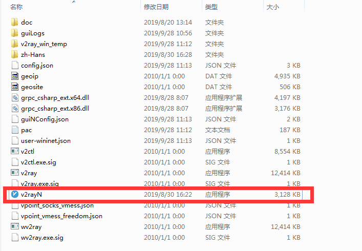

第二步在任务栏中找到蓝色V图标，单击打开客户端界面，然后在服务器下拉中找到添加Vmess服务器选项

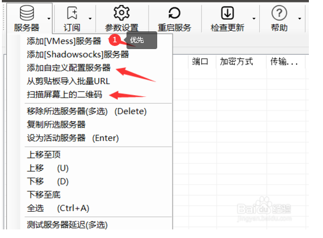

第三步，按照分享的账号信息逐一填写后，选择确定

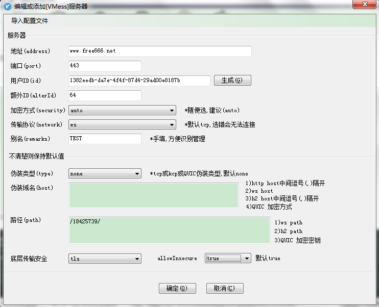

第四步，在任务栏中右键蓝色V图标，选择开启HTTP代理，接着在HTTP代理模式中选择开启代理并自动保存配置全局或者PAC模式即可开始畅游墙外的世界了。

**2、Mac系统的图文使用方法**

第一种，使用[v2rayX（第三方开发）](https://github.com/insisttech/v2rayX-copy/releases) 

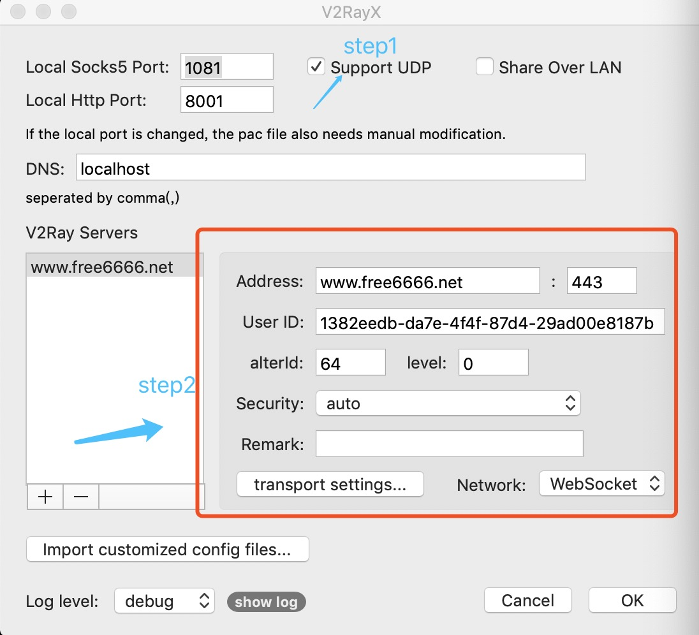

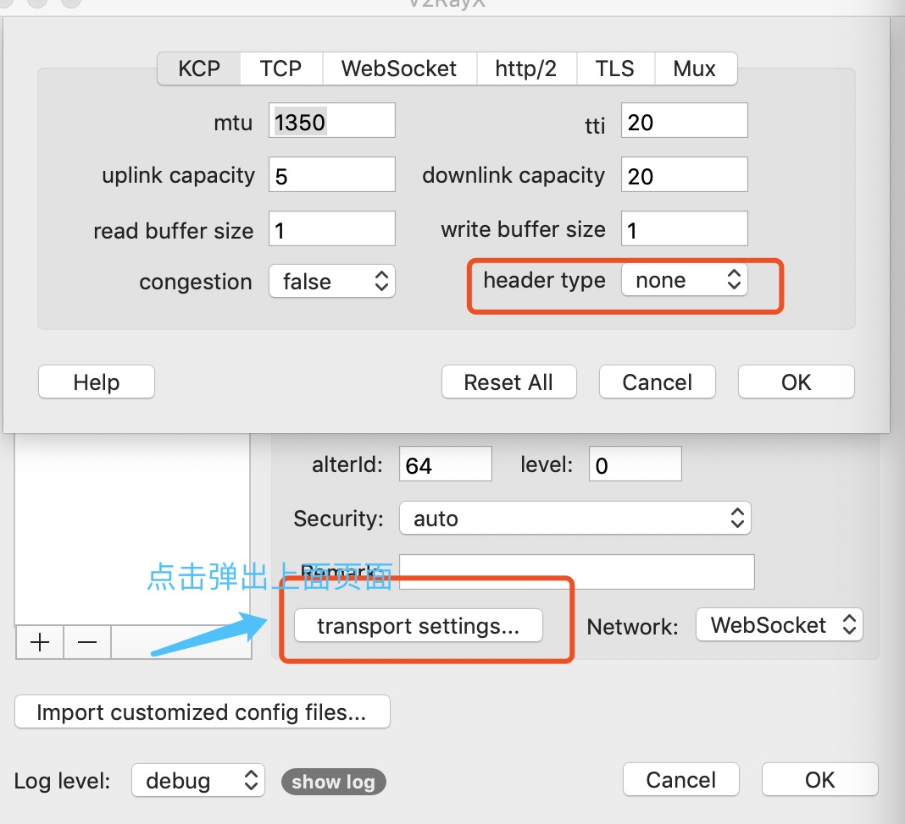

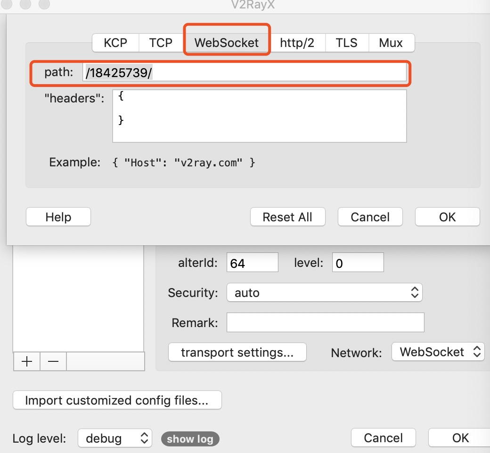

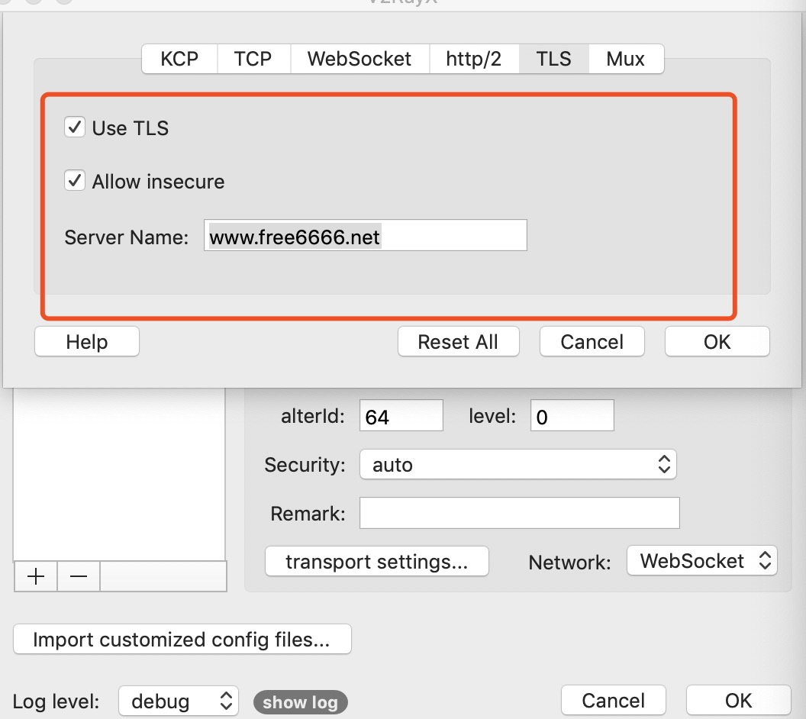

填写完信息后点击ok进行保存，点击load un即可开始使用。模式选择pac就行，全局也可以（全局有时候会导致国内网络无法使用）

更详细方法可参考：https://book.v2rayx.org/mac.html

第二种，使用[v2rayU（第三方开发）](https://github.com/yanue/V2rayU/releases)

正常安装程序,点击应用程序中的 V2RayU 图标:勾选 pac 模式、点击服务器设置

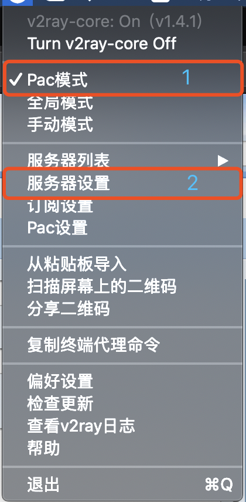

如图配置:

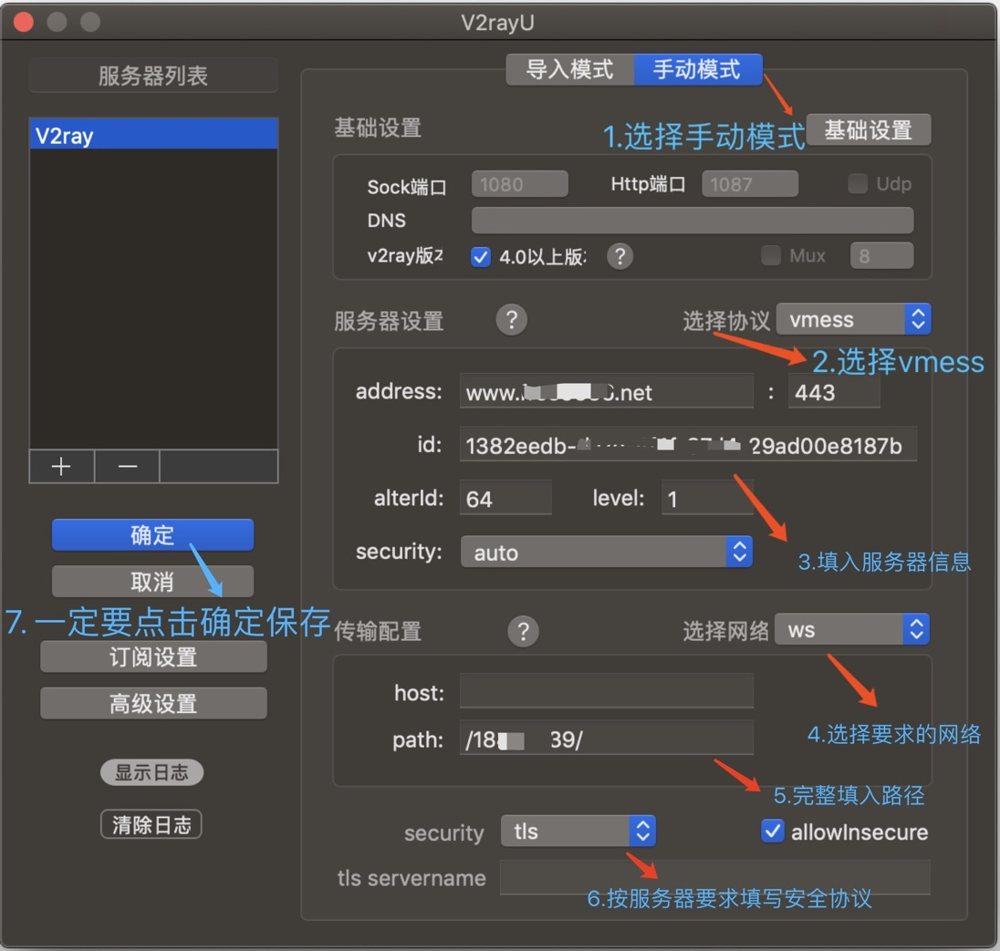

确定如图状态就是已经开启, 即可开始畅游墙外的世界

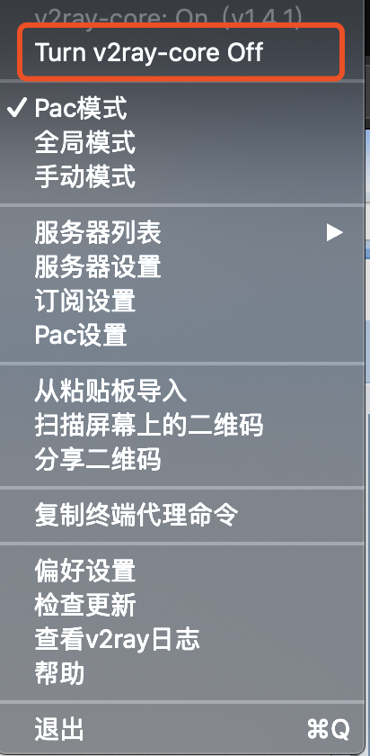

**3、iOS系统的图文使用方法**

iOS：[没有美区AppleID的翻墙教程](./苹果手机翻墙软件.md) [iOS注册美区Apple ID教程](./iOS注册美区Apple-ID教程.md) 

**4、安卓系统的图文使用方法**

v2ray vpn:[下载1](http://d1.bdrive.tk/v2ray.vpn-universal-release.apk) 
[下载2](http://d1.bdrive.tk/v2ray.vpn-universal-release.apk)  (内置v2ray账号)

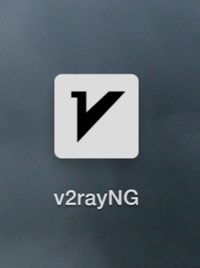

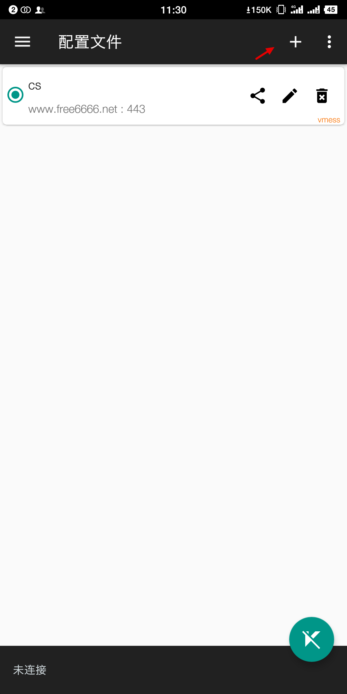

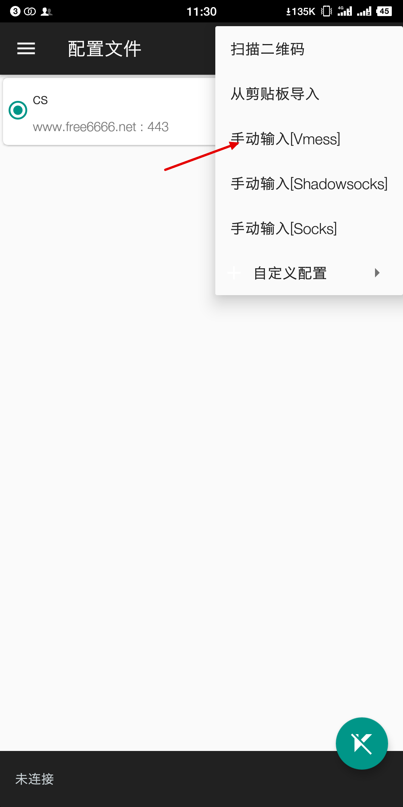

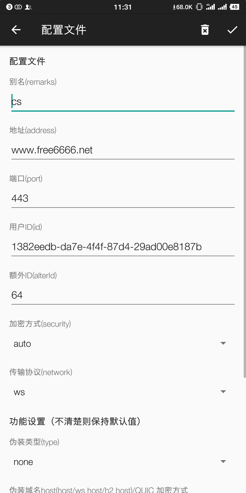

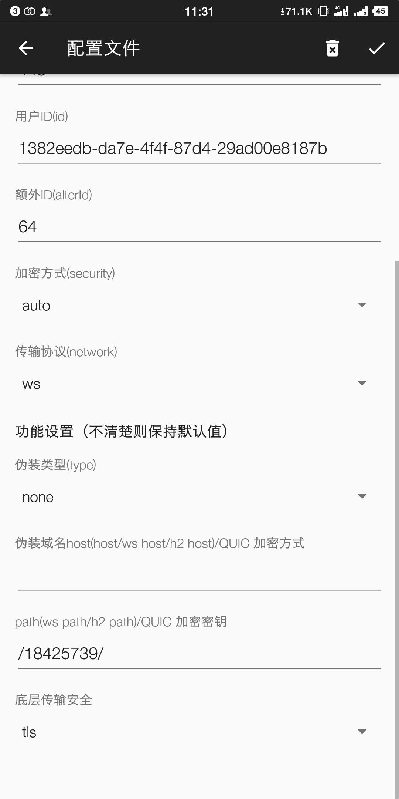

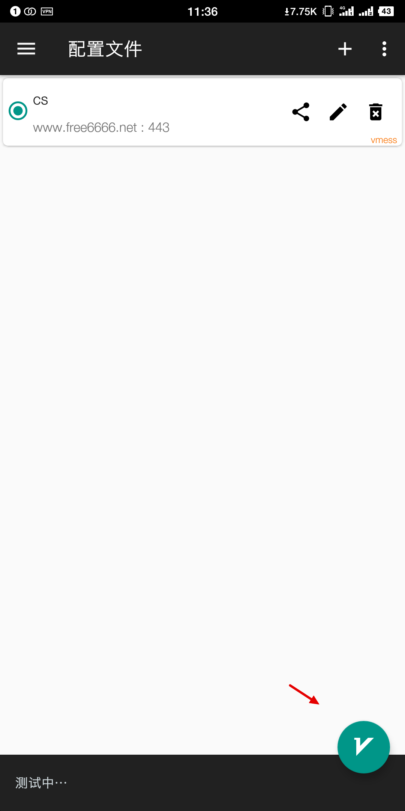

注: 1、最下端的测试结果不完全正确，即便失败也可以在浏览器里试一试。2、不成功可以考虑重启手机(靠飞行模式"重启"无效)。3、如果选绕过大陆和局域网不行，可以切换模式为全局模式
