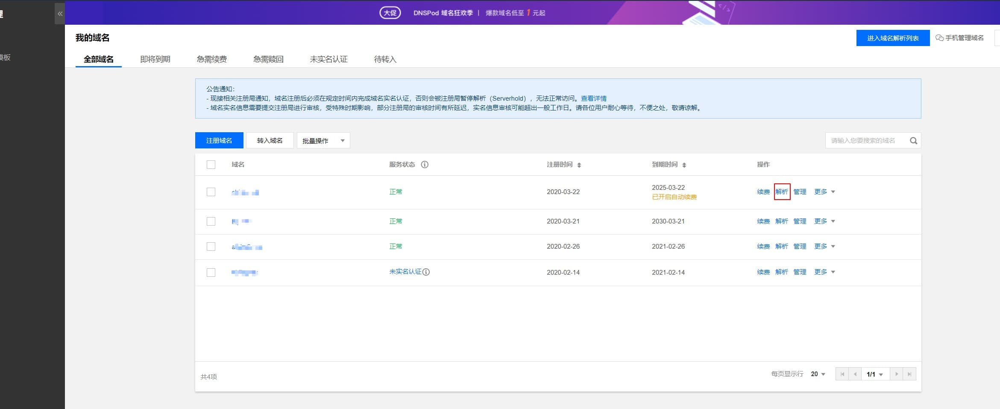
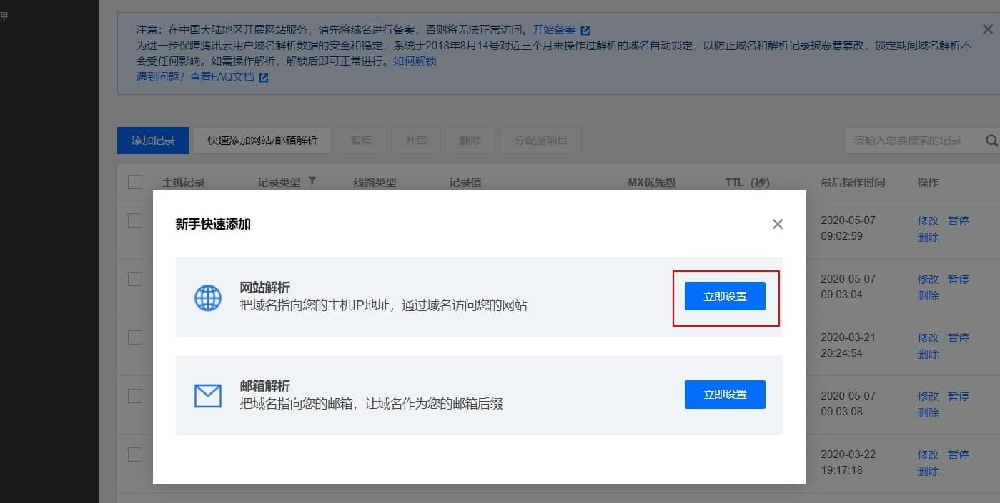
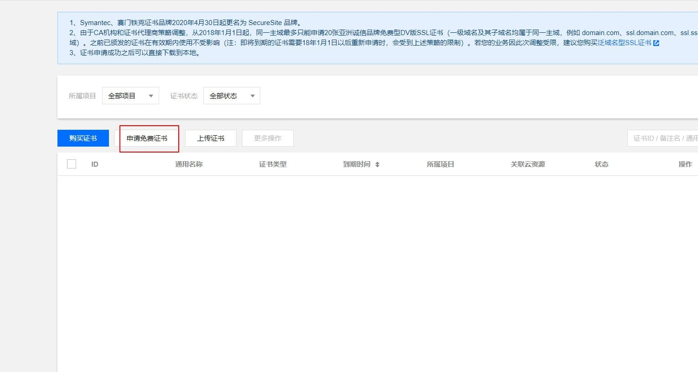
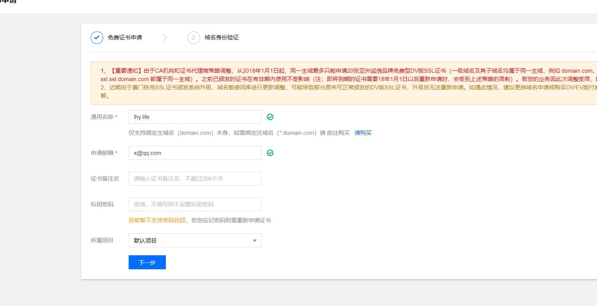
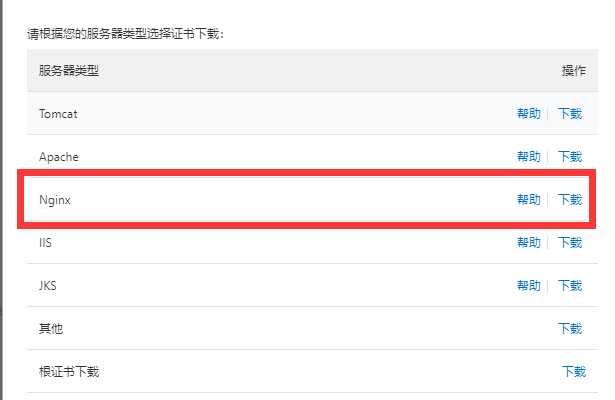
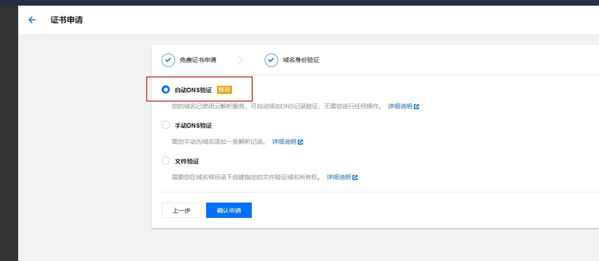
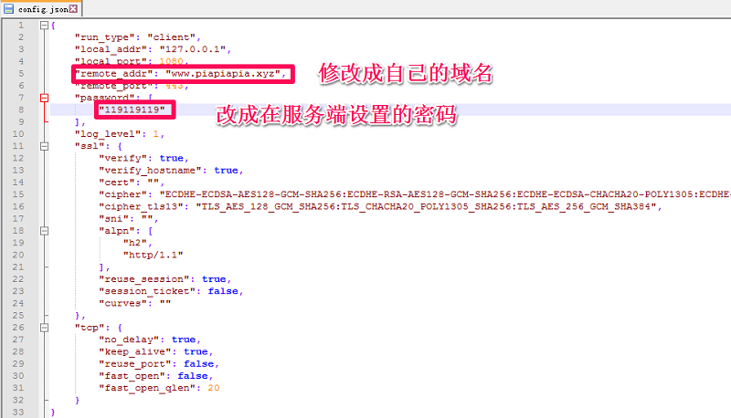

# Trojan 手动搭建教程
Trojan 手动搭建教程！Trojan 是最新的扶墙技术，它模仿了互联网上最常见的协议 HTTPS，以欺骗 GFW 认为它是正常 HTTPS 流量，同时又拥有一定的反检测机制。

通过 Trojan 客户端访问的流量则启动代理，连接目标网络。非 Trojan客户端访问的流量，则转发至Web服务器端口，显示一个“伪装”的网站内容。Github地址

搭建 Trojan ，你得首先有一台外网 VPS ，最好选择 CN2GIA 线路的 VPS ，以保证在各种高峰时期也能畅通无阻的起飞。

搭建教程可简单分为三个部分，
1. 域名购买、解析并申请 SSL 证书；
2. Trojan 服务端配置；
3. Trojan 客户端配置。

下面将进行详细讲解。

### 1、域名购买、解析并申请SSL证书
这里以腾讯云为例，进入腾讯云官网新用户注册域名应该不超过10元/首年。注册好之后进入域名管理页面，点击解析。


点击快速添加网站/邮箱解析，添加网站解析，输入你 VPS 的 IP 地址点击确定。解析一般10分钟内生效。


进入SSL证书页面点击申请免费证书，选择免费1年的亚洲诚信，输入你注册的域名和邮箱直接点击下一步。




如果你前面域名解析设置对了，这里直接会有自动 DNS 验证，点击确认申请。一般10分钟内就行。


申请好之后回到SSL证书页面会显示已颁发，点击下载到本地解压，并将 Nginx 文件夹里面的xx.crt重命名为certificate.crt，xx.key重命名为private.key然后保存好备用。

### 2、Trojan服务端配置
Trojan 服务端官方一键搭建脚本
```shell script
sudo bash -c "$(curl -fsSL https://raw.githubusercontent.com/trojan-gfw/trojan-quickstart/master/trojan-quickstart.sh)"
```
安装好之后的相关程序目录：
- 二进制主文件目录 `/usr/local/bin/trojan`
- 配置文件目录 `/usr/local/etc/trojan/config.json`
- systemd 进程守护文件目录 `/etc/systemd/system/trojan.service`

添加 SSL 证书。创建trojancert文件夹，并把上面准备好的`private.key`和`certificate.crt`文件放到trojancert文件夹
```shell script
mkdir -p /usr/local/etc/trojancert   #创建trojancert文件夹
```
修改 Trojan 配置文件，主要是修改密码`password1`为你的密码，SSL 证书目录改为`/usr/local/etc/trojancert/`，修改后的配置文件如下：
```json
{
    "run_type": "server",
    "local_addr": "0.0.0.0",
    "local_port": 443,
    "remote_addr": "127.0.0.1",
    "remote_port": 80,
    "password": [
        "password1" // 设置客户端连接密码，不支持特殊符号，可设置多个密码，用于多用户连接使用
    ],
    "log_level": 1,
    "ssl": {
        "cert": "/usr/local/etc/trojancert/certificate.crt", // 改成上传证书的.pem/.crt文件路径
        "key": "/usr/local/etc/trojancert/private.key", // 改成证书.key文件路径
        "key_password": "",
        "cipher": "ECDHE-ECDSA-AES128-GCM-SHA256:ECDHE-RSA-AES128-GCM-SHA256:ECDHE-ECDSA-AES256-GCM-SHA384:ECDHE-RSA-AES256-GCM-SHA384:ECDHE-ECDSA-CHACHA20-POLY1305:ECDHE-RSA-CHACHA20-POLY1305:DHE-RSA-AES128-GCM-SHA256:DHE-RSA-AES256-GCM-SHA384",
        "cipher_tls13": "TLS_AES_128_GCM_SHA256:TLS_CHACHA20_POLY1305_SHA256:TLS_AES_256_GCM_SHA384",
        "prefer_server_cipher": true,
        "alpn": [
            "http/1.1"
        ],
        "alpn_port_override": {
            "h2": 81
        },
        "reuse_session": true,
        "session_ticket": false,
        "session_timeout": 600,
        "plain_http_response": "",
        "curves": "",
        "dhparam": ""
    },
    "tcp": {
        "prefer_ipv4": false,
        "no_delay": true,
        "keep_alive": true,
        "reuse_port": false,
        "fast_open": false,
        "fast_open_qlen": 20
    },
    "mysql": {
        "enabled": false,
        "server_addr": "127.0.0.1",
        "server_port": 3306,
        "database": "trojan",
        "username": "trojan",
        "password": "",
        "cafile": ""
    }
}
```
创建 Trojan 自启服务
- 在`/lib/systemd/system/`目录下创建`trojan.service`文件 ，并复制下面代码到文件中，保存。
```
[Unit]  
Description=trojan  
After=network.target  
   
[Service]  
Type=simple  
PIDFile=/usr/src/trojan/trojan/trojan.pid
ExecStart=/usr/src/trojan/trojan -c "/usr/src/trojan/config.json"  
ExecReload=  
ExecStop=/usr/src/trojan/trojan  
PrivateTmp=true  
   
[Install]  
WantedBy=multi-user.target
```

重启 Trojan 和设置 Trojan 开机自动启动
```shell script
systemctl restart trojan
systemctl enable trojan
systemctl status trojan
```
有防火墙的开启防火墙的 443 和 80 端口
```shell script
firewall-cmd --zone=public --add-port=80/tcp --permanent
firewall-cmd --zone=public --add-port=443/tcp --permanent
firewall-cmd --reload
```

### 3、Trojan 客户端配置
Trojan 官方的客户端只有命令行界面，且没有设置和分流功能，这里建议用 clash 的相关客户端代替，目前 clash 已支持 Trojan 等各种主流的代理协议，修改 clash 配置文件的 Proxy 段为 trojan 。
```shell script
name: "随意改成你的名称"
type: trojan
server: 你的域名，如xx.com
port: 443
password: 你的密码
```

各种支持 Trojan 的客户端：
- Windows：clash for windows、Trojan-Qt5、v2rayN-trojan
- macOS：clashX、Trojan-Qt5
- Android：igniter、Clash For Android、Pharos-Android
- iOS：Shadowrocket、Quantumult X、Pharos Pro
- OpenWrt 路由器：OpenClash、ssr-plus
- clash 的 web 控制面板：yacd
- 游戏加速器：Netch

clash 的各种规则：
- ConnersHua（神机规则）、Hackl0us

clash相关使用教程文档：
- clash、clash for windows

### 4、为 VPS 配置 BBRPLUS 加速（强烈建议）
一键脚本（仅限 CentOS 系统，CentOS 7.7 及以上版本慎用），安装后会提示重启
```shell script
wget "https://github.com/cx9208/bbrplus/raw/master/ok_bbrplus_centos.sh" && chmod +x ok_bbrplus_centos.sh && ./ok_bbrplus_centos.sh
```
重启后执行`uname-r`显示4.14.129-bbrplus则切换内核成功

执行`lsmod|grepbbr`显示有bbrplus则开启成功

### 5、为 Trojan 配置伪装站点（可选）
安装 Nginx
```shell script
yum -y install  nginx wget unzip zip curl tar  #安装Nginx
systemctl enable nginx   #设置Nginx开机启动
```
配置 Nginx，找到路径`/etc/nginx/nginx.conf`替换以下代码
- Nginx 不需要配置SSL文件，因为通过Trojan打过来的请求，都已经配置过SSL文件。
- 直接访问80端口的Nginx，本身也是没有SSL的。
```
user  root;
worker_processes  1;
error_log  /var/log/nginx/error.log warn;
pid        /var/run/nginx.pid;
events {
    worker_connections  1024;
}
http {
    include       /etc/nginx/mime.types;
    default_type  application/octet-stream;
    log_format  main  '\$remote_addr - \$remote_user [\$time_local] "\$request" '
                      '\$status \$body_bytes_sent "\$http_referer" '
                      '"\$http_user_agent" "\$http_x_forwarded_for"';
    access_log  /var/log/nginx/access.log  main;
    sendfile        on;
    #tcp_nopush     on;
    keepalive_timeout  120;
    client_max_body_size 20m;
    #gzip  on;
    server {
        listen       80;
        server_name  $your_domain;
        root /usr/share/nginx/html;
        index index.php index.html index.htm;
    }
}
```
配置伪装站点，请自行找个网站模板放进`/usr/share/nginx/html/`目录下，然后重启 Nginx `systemctl restart nginx`
```shell script
rm -rf /usr/share/nginx/html/*   #删除目录原有文件
cd /usr/share/nginx/html/    #进入站点更目录
wget https://github.com/V2RaySSR/Trojan/raw/master/web.zip
unzip web.zip    #也可以上传自己的网站
systemctl restart nginx.service
```
访问 `https:// 你的域名`，如果能打开网站则配置成功。
​
### 客户端配置使用
下载客户端： `https://github.com/trojan-gfw/trojan/releases` (选择后缀是-win.zip或者-macos.zip的文件下载)

解压并用记事本或者其他编辑器打开`config.json`文件，按下图修改配置文件


双击打开trojan.exe，别慌，这只是开启了trojan服务，但是还不能上网，还需要借助其他客户端配合才行
